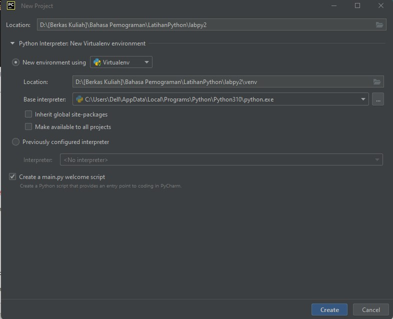

# Belajar Bahasa Pemograman Python
Pertama kita harus mendownload dulu program [Python 3.10](https://www.python.org/).

# Buka Program Python dengan CMD Path
Buka Command Prompt di PC kalian.

Kemudian panggil path Python dengan  command ***python***.
> python

# Masukkan Perintah Dasar Python
Menampilkan Tulisan dengan perintah ***print***.
> print("Hello")
>
> print("Saya sedang belajar Python")

# Menjumlahkan 2 Bilangan Menggunakan Variable
- Mendefinisikan variable ***a*** dengan nilai 8
- Mendefinisikan variable ***b*** dengan nilai 6
- Mencetak nilai variable ***a*** dan ***b***
- Mencetak hasil penjumlahan ***a + b***

> ***a*** = 8
> 
> ***b*** = 6
> 
> print ("variable a=",***a***)
> 
> print ("variable b=",***b***)
> 
> print ("hasil penjumlahan a+b",***a+b***)

# Belajar Program Idle (Python)
Buka program Idle dan kita coba untuk Menentukan Hasil Penggabungan, Penjumlahan, dan Pembagian.
### Menggunakan fungsi ***Input*** untuk mengambil nilai variabel dari keyboard
> ***input nilai variable***
> 
> a=input("Masukkan nilai a:")
> 
> b=input("Masukkan nilai b:")
>
> ***cetak nilai variable***
> 
> print("Variabel a=",a)
> 
> print("Variabel b=",b)
> 
> ***cetak hasil operasi kedua dengan String Format***
> 
> print("Hasil penggabungan {1}&{0}=%s".format(a,b) %(a+b))
>
> ***konversi nilai variable***
> 
> a=int(a)
> 
> b=int(b)
> 
> print("Hasil penjumlahan {1}+{0}=%s".format(a,b) %(a+b))
> 
> print("Hasil pembagian {1}/{0}=%s").format(a,b) %(a/b))

Jika sudah kita coba untuk Run program yang telah kita buat!

> ⚠ Pastikan lokasi penyimpanannya di dalam Folder: **labpy2/**.

# Pycharm

  

Setelah semua selesai, kita lanjut belajar program [PyCharm](https://www.jetbrains.com/pycharm/download/) 

##Buka Program PyCharm
Buat Project Baru/ New Project, dan pastikan lokasi project berada di dalam Folder: **labpy2/**.

Buat File Python baru,

dan beri nama "main"

Kemudian kita masukan perintah untuk menghitung Luas dan Keliling Lingkaran
> r = input("Masukkan jari-jari lingkaran : ")
> 
> pi = 3.14
> 
> l = pi * int(r) * int(r)
> 
> k = 2 * pi * int(r)
> 
> print("Luas Lingkaran     : ",l)
> 
> print("Keliling Lingkaran : ",k)

